# Software Deployment Lab on Windows Server 2022
This virtualized lab showcases the deployment of widely used end-user software (Google Chrome and Adobe Reader) to client PCs using Windows Server 2022 as a Domain Controller with Active Directory (AD) integration. It includes configuration of Group Policy for automated software distribution in an offline enterprise environment.

- Windows Server 2022 (Domain Controller, AD, Group Policy)
- Windows 11 Pro (Client Machines)
- VirtualBox (Virtualization Platform)
- Active Directory, Group Policy, File Sharing

Installed Windows Server 2022 and 2 versions of Windows 11 Pro

  - Created new groups in Active Directory named ChromeUsers and AdobeUsers

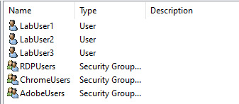

  - Added Client1 and Client2 PC's to members of the ChromeUsers and AdobeUsers groups

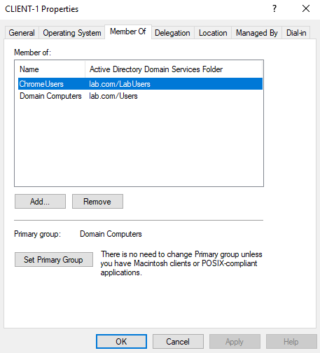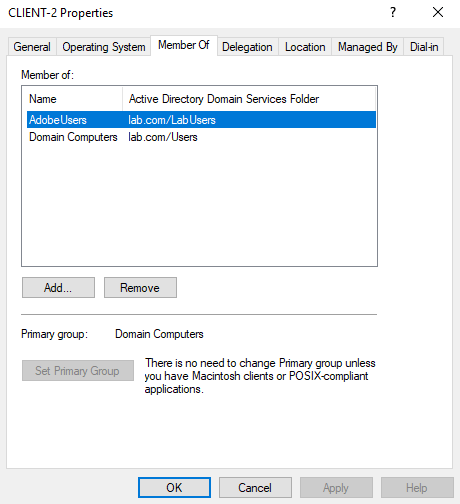

  -   Created 2 new GPO's under lab.com named AdobeDeploymentGPO and ChromeDeploymentGPO

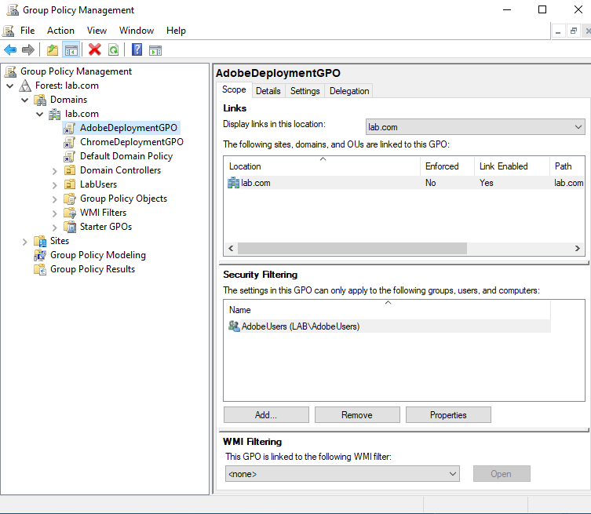

  - Added ChomeUsers and AdobeUsers group to Security Filtering respectfully

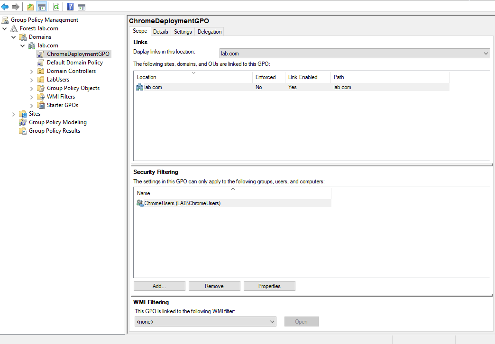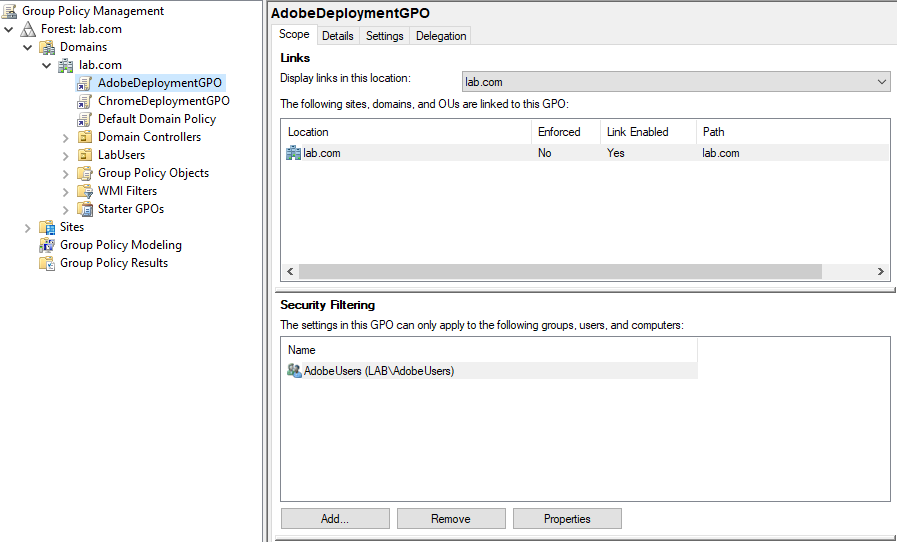

  - Created new package for Chrome and Adobe installations

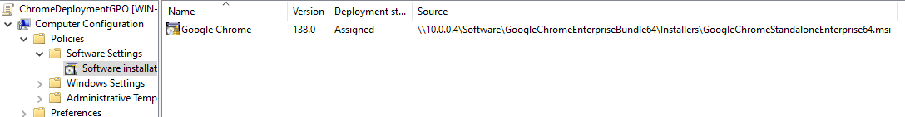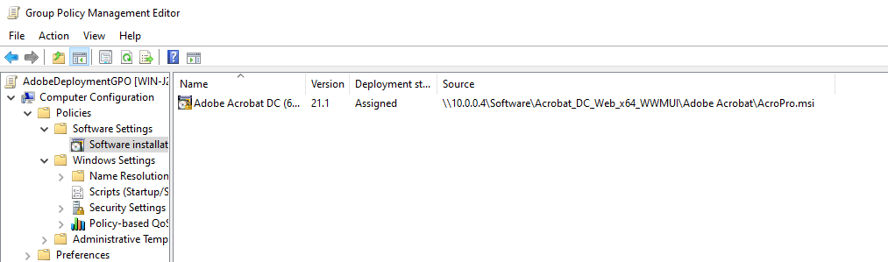

  - Forced Group Policy updates on Client1 and Client2

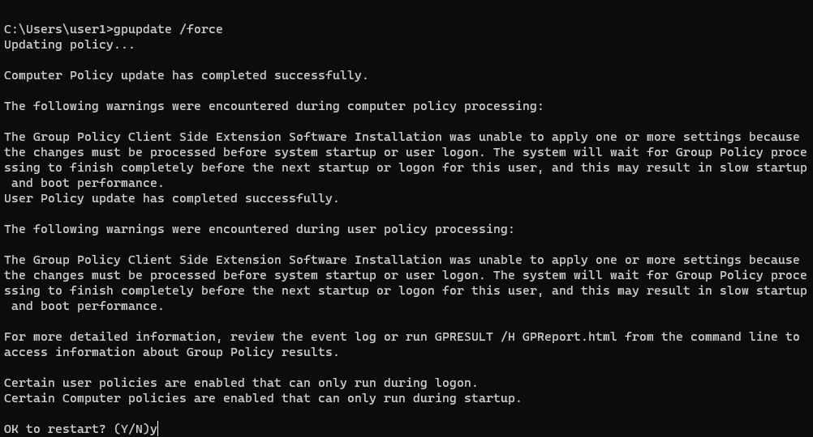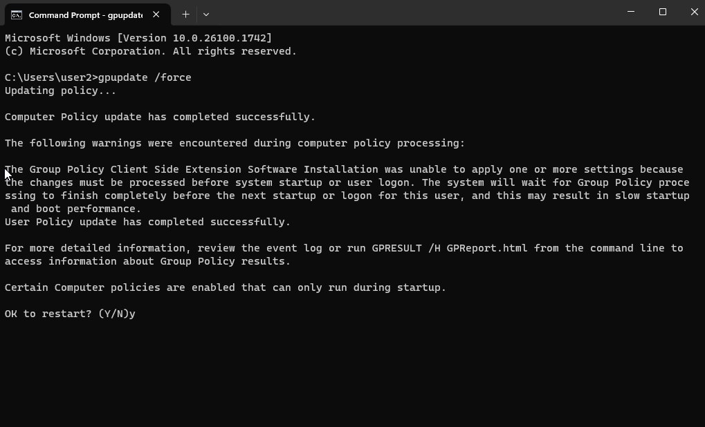

  - Confirmed installation after restart and login of Client1 and Client2 PC's

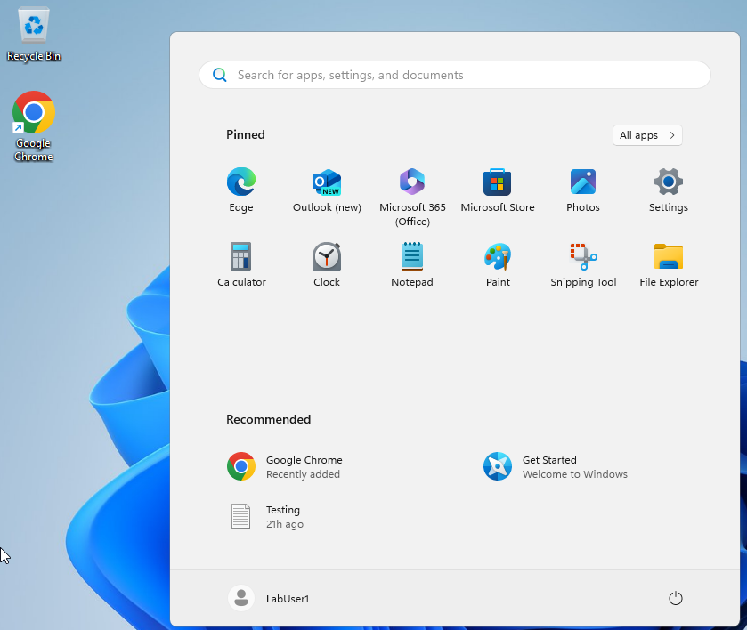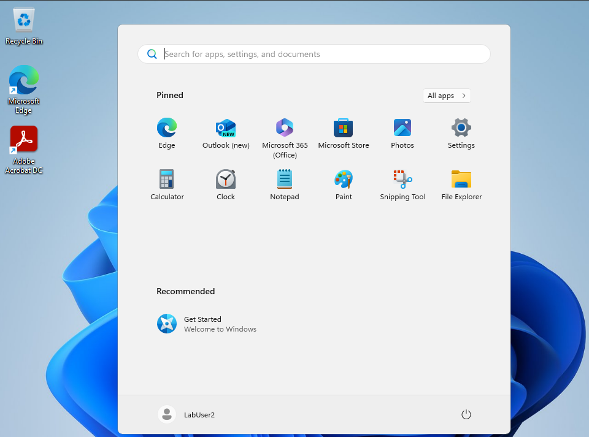
